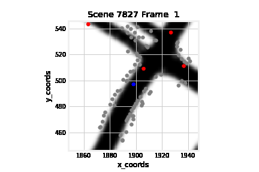
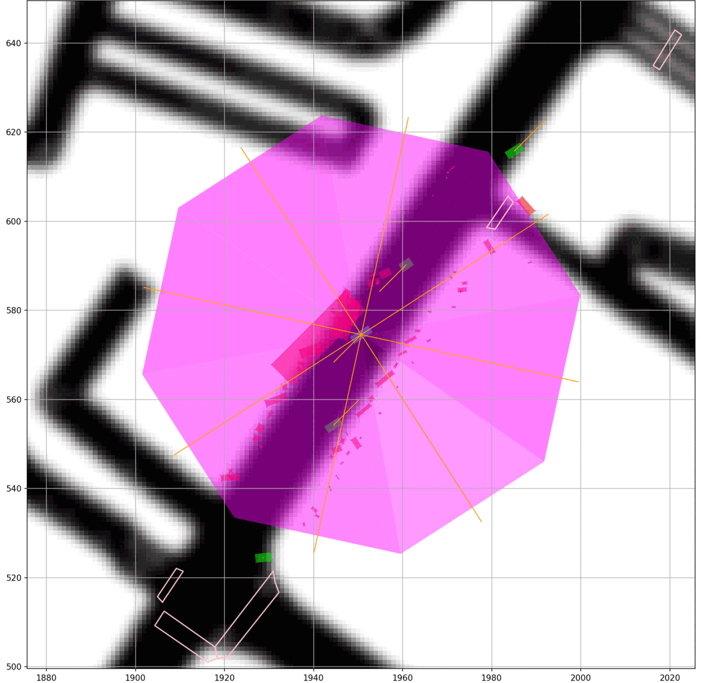
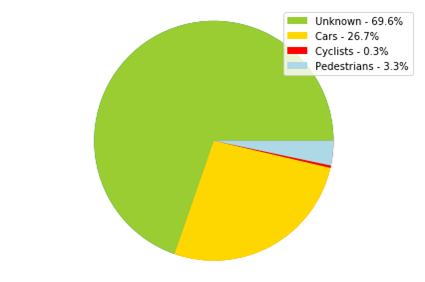
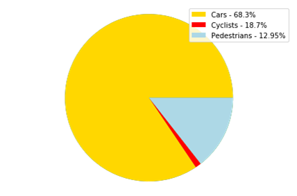
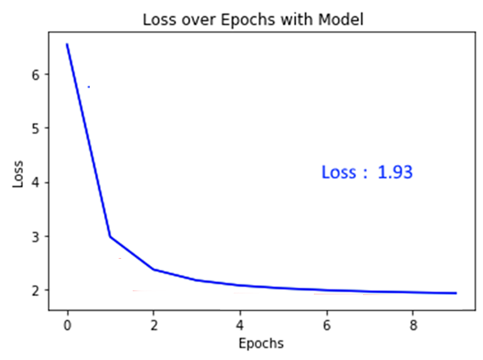
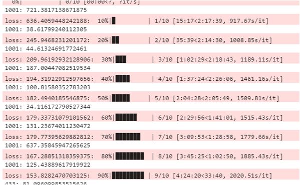

# DS3_Lyft
DS3 Project Group: Lyft motion prediction project. Prediction modelling and statistics for street data and car movements from Lyft's Kaggle dataset.

Folders:
* lyftlong - csv files for the data used in the RNN notebooks and the EDA notebooks
* Lyft_scripts - python files for Keras model,

Our Random Forest Notebook:
* lyft_neural_network_setup_new.ipynb (Mingjia Zhu)

Our Kaggle Competition Notebook:
* ds3lyftproject.ipynb (Jianyu Tao)

Our Keras Model Notebook: 
* Lyft_scripts/Lyft_scripts_jupyter_tester_all_agent_centeronly.ipynb (Benson Duong)

# Project

In 2020, the company Lyft had released a dataset on Kaggle of the street data collected by its AI vehicle in the city of Palo Alto.
On October 2020, DS3 -a data-science student society at UCSD- had organized an event lasting up to Februrary 2021, where different teams would research and work on data-science projects. Our team consisted of Mingjia Zhu, Lehan Li, Jianyu Tao, and Benson Duong, and we were given a Kaggle dataset released by the company Lyft that featured street data collected by its AI vehicle in the city of Palo Alto.

Our project had 2 goals, where we attempted to classify moving on-road objects, and create a rough time-series prediction model based on the movement of Lyft's car.

# Project Task 1 -  Moving on-road object classification

* We attempted to classify unknown moving on-road objects into 3 known groups: cars/vehicles, cyclicts, and pedestrians.
* We used Random-Foresting, and used the object's 3 dimensions and its speed as features for training

Before Random Foresting

After Random Foresting

The classification showed that among the 4 features used, speed was the least useful/needed feature, while physical dimensions of the vehicle were more useful.

# Project Task 2 -  Predictive Modelling 
* For prediction modelling on the vehicle's movements, we used keras and pytorch.

Keras Loss

Pytorch Loss

